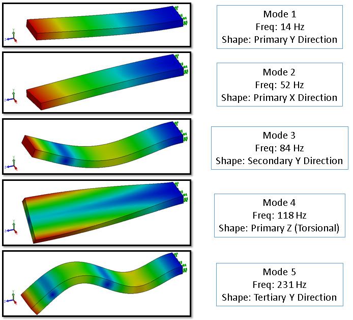

# An Introduction to Modal Analysis: Understanding the Dynamic Behavior of Structures

## Table of Contents
- [1. Learning Objectives](#10-learning-objectives)
- [2. Key concepts](#20-key-concepts-and-definitions-in-modal-analysis)
- [3. Mathematical foundation](#30-the-mathematical-foundation-of-modal-analysis)
- [4. FEM Analysis](#40-computational-modal-analysis-via-the-finite-element-method-fem)
- [5. Experimental Modal analysis](#50-experimental-modal-analysis-ema-a-generic-summary)
- [6. Importance of Modal analysis](#60-the-influence-and-importance-of-modal-analysis)
- [7. Real life examples](#70-real-life-examples)
- [8. Conclusion](#80-conclusion)
- [9. References](#90-references)


------------------------------------------------------------------------

# 2.0 Key Concepts and Definitions in Modal Analysis

To understand a structure's dynamic behavior, one must first grasp its
inherent vibrational properties. These properties are not random; they
are intrinsic characteristics determined by the structure's mass,
stiffness, and energy dissipation mechanisms. This section defines the
essential modal parameters that characterize how any structure---from a
simple beam to a complex bridge---responds to dynamic forces.




------------------------------------------------------------------------
# Modal Analysis: Understanding Structural Vibration

Modal analysis is a basic part of structural engineering that gives you the tools you need to understand, predict, and control how structures vibrate. Modal analysis is important for making safe, reliable, and efficient designs, from making sure that a bridge can handle traffic loads to improving the performance of an aerospace part. This report is a complete introduction for professionals who want to learn the basics and how to use this powerful engineering technique in real life. The following goals will help you learn the most important things and give you a clear path to understanding how structural vibration works in the real world.

---

## 1.0 Learning Objectives

Define modal analysis and its core components: natural frequency, mode shape, and damping.

Understand the fundamental mathematical principles governing structural vibration.

Differentiate between computational and experimental modal analysis methodologies.

Recognize the critical role of modal analysis in engineering design, diagnostics, and structural health monitoring.

Interpret real-world applications and case studies where modal analysis is applied.

We will begin by establishing the fundamental concepts and vocabulary that form the language of modal analysis.

---

## 2.0 Foundational Concepts: The Language of Modal Analysis

To understand modal analysis, you need to know the basic key points that go with it. Every structure has dynamic properties that determine how it will react to forces, no matter how big or complex it is. This part explains these main ideas using simple examples and clear definitions. This sets the stage for the more technical talks that will come later.

### 2.1 What is Modal Analysis?

Modal analysis is the study of a structure's natural dynamic properties. The structure's mass and stiffness distribution determine these properties, which include its natural frequencies, mode shapes, and damping. These are important because they are inherent traits that are not affected by outside forces or loads acting on the structure. Modal analysis shows how a structure naturally wants to move.

### 2.2 Natural Frequencies and Resonance

If a structure is disturbed and then allowed to vibrate freely, it will naturally oscillate at its natural frequency. Think about a simple plate. If you push on it with a force that changes, the plate will respond in different ways. Resonance happens when the frequency of an outside force matches one of the plate's natural frequencies. When resonance happens, the vibration's amplitude goes up a lot, even though the force that caused it stays the same. This phenomenon can lead to excessive movement, noise, and, in severe cases, fatigue and structural failure. A classic example is the Tacoma Narrows Bridge (1940), where resonance caused catastrophic failure.


### 2.3 Mode Shapes: The Patterns of Vibration

A mode shape is the specific deformation pattern that a structure exhibits when it vibrates at one of its natural frequencies. Think of it as a guitar string. When plucked, it can vibrate in a simple arc (its first mode), in an 'S' shape with a stationary point in the middle (its second mode), and so on. Each of these patterns is a unique mode shape that corresponds to a specific natural frequency. Each natural frequency has a corresponding mode shape. For example, the first natural frequency of a simple beam or plate often corresponds to a "first bending" mode, where the structure flexes in a simple curve. Higher frequencies will correspond to more complex patterns, such as a "first twisting" mode or "second bending" mode, where the structure deforms with multiple curves. These patterns are fundamental to understanding how different parts of a structure move relative to each other during vibration.

### 2.4 Damping: The Energy Dissipation Factor

Damping is what makes vibrations get weaker over time in a system. It does this by letting energy go, usually as heat. Damping can be a natural property of a material (like internal friction) or it can be caused by things outside of the material, like air resistance or friction at joints. Damping is what limits the amplitude of vibration at resonance and makes free vibrations stop after a while. It is usually a small factor.

### 2.5 Key Measurement: The Frequency Response Function (FRF)

The Frequency Response Function (FRF) is an important part of experimental modal analysis. It is the ratio of the output response of a structure (like acceleration) to the input force applied to it, measured over a range of frequencies. An FRF makes it easy to see the structure's natural (resonant) frequencies because it has clear peaks at each one. This plot is a strong and direct way to find out what the most important dynamic properties of a physical structure are.

---

## 3.0 The Mathematical Framework of Vibration

It's important to understand the math behind modal analysis because it turns abstract ideas like mass and stiffness into a way to make predictions. Engineers use the equations in this section to model, simulate, and analyse how a structure moves over time. These equations are the basis for modern computer programs.

### 3.1 The General Equation of Motion

A basic second-order differential equation can describe how any structural system with more than one degree of freedom moves. This equation of motion looks like this in matrix form:

```
[M]{ü(t)} + [C]{u̇(t)} + [K]{u(t)} = {p(t)}
```

Each term in this equation represents a fundamental physical property of the system:

| Term   | Description                                                             |
| ------ | ----------------------------------------------------------------------- |
| [M]    | Mass Matrix (Represents the structure's inertial properties)            |
| [C]    | Damping Matrix (Represents energy dissipation)                          |
| [K]    | Stiffness Matrix (Represents the structure's resistance to deformation) |
| {u(t)} | Vector of nodal displacements as a function of time                     |
| {p(t)} | Vector of external forces applied to the structure                      |

This equation is a mathematical expression of Newton's Second Law applied to a structure: it states that the external forces ({p(t)}) are balanced by the sum of the structure's inertial forces (mass times acceleration, [M]{ü(t)}), damping forces (proportional to velocity, [C]{u̇(t)}), and elastic restoring forces (proportional to displacement, [K]{u(t)}).

### 3.2 The Eigenvalue Problem: Finding Modes and Frequencies

We look at how the structure behaves during free, undamped vibrations to find its natural frequencies and mode shapes. In this case, there are no outside forces acting on the system ({p(t)} = {0}) and damping is thought to be very small ([C] = {0}). This simplification helps us separate the structure's intrinsic properties—how it wants to vibrate—from the effects of outside forces and energy loss.

This simplification changes the general equation of motion into a basic eigenvalue problem, which can be written as:

```
([K] - λ[M]) {φ} = {0}
```

or, more commonly:

```
[K]{φ} = λ[M]{φ}
```

Solving this equation yields the structure's inherent modal properties:

Eigenvalues (λ): The solutions for λ are directly related to the squared natural frequencies of the system (λj = ωj²). Each eigenvalue represents a frequency at which the structure naturally vibrates.

Eigenvectors ({φ}): For each eigenvalue, there is a corresponding eigenvector {φ}, which is the mode shape. It describes the pattern of deformation the structure undergoes when vibrating at that specific natural frequency.

---

## 4.0 Methodologies for Modal Analysis

There are two main ways that engineers do modal analysis. The first is computational, which means using software to guess how a structure will vibrate before it is built. The second is experimental, and it uses physical tests to see how a real-world object acts. The two methods work very well together. Experimental data is often used to check and improve computational models. This part will focus on the computational method, and then there will be a short summary of the experimental method.

### 4.1 Computational Modal Analysis (CMA) via the Finite Element Method (FEM)

Computational Modal Analysis (CMA) using FEM engineers often use Computational Modal Analysis (CMA) to forecast virtual model temporal behaviour. Most use the Finite Element Method (FEM). It simplifies complex structures into little elements. FEA for modal analysis follows these steps:

1. Pre-Processor: At this step, the physical structure is mathematically modelled. Create a "mesh" of connected finite elements to depict the shape. Engineers establish material parameters like Young's Modulus and density and boundary conditions like fixed supports to sustain or limit the construction.

2. Solution: FEA software solves the meshed model using basic equations of motion. After building the mass [M] and stiffness [K] matrices using geometry and material data, it solves the eigenvalue problem to obtain the system's natural frequencies and eigenvectors.

3. Post-Processor: Analyse and review data. Reviewing the solution results lets engineers explore tables of computed natural frequencies and animate mode shapes to show how the structure deforms at each frequency.

Limitations of Computational Modal Analysis (CMA) depends on idealised assumptions that are not often true in real life, like perfect material homogeneity, isotropic properties, and rigid boundary conditions.

Main Causes of Uncertainty:

Boundary Conditions: In tests in the real world, "fixed" or "pinned" supports often show unexpected flexibility.

Material Variability: The properties of the material, such as Elastic Modulus, may not be the same across the whole structure.

Joint Stiffness: It's hard to perfectly model how stiff connections are.

### 4.2 Experimental Modal Analysis (EMA): A Generic Summary

Experimental Modal Analysis (EMA) finds a structure's physical modal parameters, like its natural frequencies, damping, and mode shapes, by using test data to check computer models.

Key Process Steps:

Instrumentation: Sensors (usually accelerometers) are attached to the structure to pick up vibrations.

Excitation: An impact hammer or shaker is used to make something vibrate by applying a known force.

Data Acquisition: We use FFT analysis to get the input force and output reaction, which lets us find the Frequency Reaction Functions (FRFs).

Parameter Extraction: The software looks at the peaks in the FRF to find the exact frequencies and mode shapes.

---

## 5.0 Implementation in Ansys

Step 1: Workbench Setup

Choose System:

From the Toolbox, drag Modal into the Project Schematic.


Geometry:

Right-click Geometry cell  Import Geometry

Geometry - windmill\_blade.stp

Engineering Data:

Add material  Composite, Epoxy/glass Fiber, woven prepreg, biax.

Set Young's Modulus (Stiffness) and Density (Mass).


Step 2: Mechanical Setup

1. Meshing

Add sizing controls to the trailing edge and tips to make the mesh more precise. Click on Mesh and then click on Generate Mesh.


2. Boundary Conditions (Setup)

Context: A windmill blade is a cantilever beam (fixed at one end, free at the other).

Right-click Modal (A5)  Insert  Fixed Support.


3. Analysis Settings

Click Analysis Settings in the tree.


Max Modes to Find: The default is usually 6. For a blade, you typically want to see at least the first 6 to 10 modes.

Phase 3: Solution & post-processing

1. Solve

Right-click Solution (A6)  Solve.

Look at the Tabular Data table to see the natural frequencies (Hz) for Review Frequencies.

2. Visualizing Mode Shapes

To see how the blade moves at these frequencies:


Select all the rows in the Tabular Data window.


Right-click  Create Mode Shape Results.

This adds "Total Deformation" items to your Solution tree.

Right-click Solution  Evaluate All Results.


From Solution Information change solution output to Participation Factor Summary


Click on each Total Deformation to see the different modes such as Flap-wise (bending flat), Edgewise (bending along the edge), or Torsional (twisting) modes.

Participation Factor: Mode participation and effective mass measure Each mode measures the mass movement in each direction. A high value indicates that excitations in that direction will effectively stimulate the mode.

Ratio of Effective Mass to Total Mass: If the ratio of effective mass to total mass is close to or equal to 1, all modes have been extracted. A 1.0 ratio is unnecessary, while ratio greater than 0.9 are usual.

---

## 6.0 The Strategic Influence and Applications of Modal Analysis

### 6.1 The Strategic Value of Modal Analysis

Core Objective: Avoiding Resonance, the fundamental purpose of modal analysis is to find a structure's natural frequencies to prevent Resonance.

Definition: Resonance occurs when an external operating frequency (e.g., wind gusts, engine rotation) meets the structure's natural frequency.

Consequence: This results in magnified vibrations that cause noise, fatigue damage, or catastrophic failure.

Solution: By identifying these frequencies early, engineers can change stiffness or mass to shift the natural frequencies away from operational ranges.

### 6.2 Applications Across Industries

| Industry               | Key Applications & Use Cases                                                                                                     | Primary Benefit                                                                    |
| ---------------------- | -------------------------------------------------------------------------------------------------------------------------------- | ---------------------------------------------------------------------------------- |
| Civil Engineering      | Structural Health Monitoring (SHM) of bridges & buildings. Real-time monitoring of snow loads on industrial roofs.               | Assess structural integrity, detect damage, and prevent collapse.                  |
| Aerospace & Automotive | Validating drone frames. Analysing brake discs (thermal/vibrational) & tire dynamics. Testing rocket engines for extreme forces. | Ensure components can withstand operational forces and optimize dynamic behaviour. |
| Industrial Machinery   | Diagnosing ground vibrations (e.g., in foundries). Condition monitoring of gearboxes and cutting machines.                       | Protect nearby communities from disturbance and enable predictive maintenance.     |
| Energy & Renewables    | Monitoring wind turbine blades and towers. Developing Borehole Thermal Energy Storage (BTES).                                    | Manage complex loads on structures and optimize efficiency in energy systems.      |

---

## 7.0 Conclusion

Modal analysis is an important and useful tool for engineers today. Systematically describes the natural frequencies and mode shapes of any structure. Engineers can better predict and find dynamic problems by simplifying physical behaviours into modal parameters.

In the study, computational analysis employs Finite Element Analysis (FEA) for virtual predictions and design optimisation, whereas experimental analysis validates and assesses physical constructions. Improve the structural dynamics of problem-solving.

Engineers can use modal analysis to guess, measure, and control vibration. It makes goods and services safer, more dependable, and more effective. It gives ideas for future parts for aeroplanes, green energy systems, and famous buildings and bridges.

---

## 8.0 References

Farrar. C. R., and K. Worden, “An introduction to structural health monitoring” Philosophical Transactions of the Royal Society A, pp 303-315, 2007.

Sreenivas Alampalli and E. Mohammed, “Structural health monitoring as a bridge management too”, Structures Congress, American Society of Civil Engineers, 3 pages, 2006.

Chaphalkar. S. P et al, “Modal analysis of cantilever beam structure using finite element analysis and experimental analysis”, American Journal of Engineering Research, vol. 4, pp 178-185, 2015.

Jayanthan M, Srinivas V, “Structural damage identification based on finite element model updating”, Journal of Mechanical Engineering and Automation, vol. 5, pp 59-63, 2015.

Avitabile, P., (2000), Modal Space: Back to Basics, Experimental Techniques, 24, No.5, pp. 15-16.

David V. Hutton, “Fundamentals of Finite Element Analysis”, Mc Graw Hills, Chapter 10, Dynamic Motion of Structures, pp. 392-396.

Clarence W. De Silva, (2004), book on “Vibration Fundamentals and Practice” Chapter 7, damping, pp. 349-398, ISBN 0-8493–1808-4.

Vibration Research. (2025, June 10). Experimental Modal testing in ObserVIEW - Recording and Analysis - Vibration research. [https://vibrationresearch.com/blog/experimental-modal-testing-obserview/](https://vibrationresearch.com/blog/experimental-modal-testing-obserview/)


